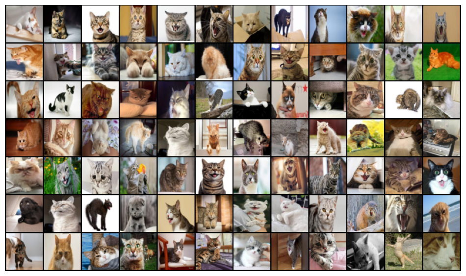
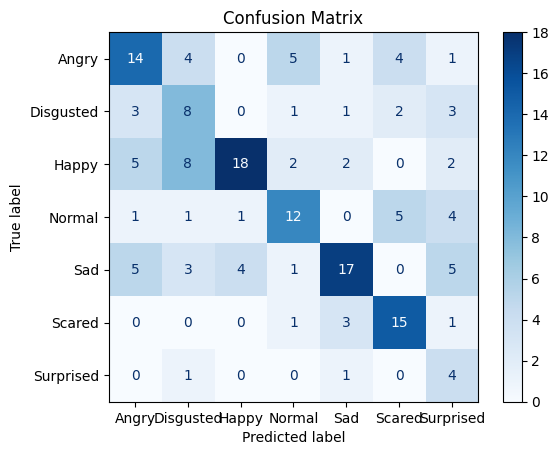

# Cat Emotion Classifier

This project trains a deep learning model to classify cat emotions from images. The final model uses a **ConvNeXt-Large** architecture and incorporates modern training techniques to achieve high accuracy.



## Project Evolution

The project started with a custom CNN with residual connections, which yielded a validation accuracy of ~26%. To improve performance, the following iterative steps were taken:
1.  **Adopted Transfer Learning (ResNet-50):** The model was upgraded to a standard ResNet-50 architecture with fine-tuning of all layers and more aggressive data augmentation. This significantly improved validation accuracy to ~60%.
2.  **Switched to ConvNeXt-Large:** To push performance further, the architecture was switched to ConvNeXt-Large.
3.  **Advanced Training Techniques:** Several modern techniques were introduced, including `TrivialAugmentWide` for data augmentation, label smoothing, the AdamW optimizer, a cosine annealing learning rate scheduler, gradient clipping, and Automatic Mixed Precision (AMP) to manage memory.

This iterative process resulted in a final validation accuracy of **~70.4%** with smaller training and validation gap.

## Running the Project

1.  Clone the repository:
    ```bash
    git clone https://github.com/parsany/CatRecognition.git
    cd CatRecognition
    ```
2.  Install the required dependencies. It is highly recommended to use a virtual environment.
    ```bash
    pip install torch torchvision scikit-learn matplotlib
    ```
    Ensure you have a version of PyTorch that supports your available hardware (CUDA for NVIDIA GPUs).

## Dataset

The model is trained on the "Cat Emotions" dataset, which is publicly available on Roboflow.
[Link to Dataset](https://universe.roboflow.com/cats-xofvm/cat-emotions)

## Final Model & Training

The best-performing model uses the following configuration:

-   **Model**: `convnext_large` pretrained on ImageNet.
-   **Data Augmentation**: `TrivialAugmentWide` for robust training.
-   **Optimizer**: AdamW with a learning rate of `1e-5` and weight decay of `1e-4`.
-   **Scheduler**: Cosine Annealing learning rate scheduler.
-   **Loss Function**: Cross-Entropy Loss with Label Smoothing (smoothing factor of 0.1).
-   **Training Features**:
    -   **Automatic Mixed Precision (AMP)**: To reduce memory footprint and speed up training.
    -   **Gradient Clipping**: To prevent exploding gradients and stabilize training.
-   **Hyperparameters**:
    -   **Epochs**: 30
    -   **Batch Size**: 8 (optimized for an ~8GB VRAM GPU)
    -   **Dropout Rate**: 0.5

## Evaluation



The model is evaluated based on its validation accuracy and loss throughout training. The final confusion matrix is generated from the best-saved model checkpoint (`best_convnext_model.pth`) to provide a clear view of its classification performance across the different cat emotions. The final model achieved a validation accuracy of **70.41%**.

## Update:
tested on the [dog emotion](https://www.kaggle.com/datasets/danielshanbalico/dog-emotion) generally and got **85%%**.